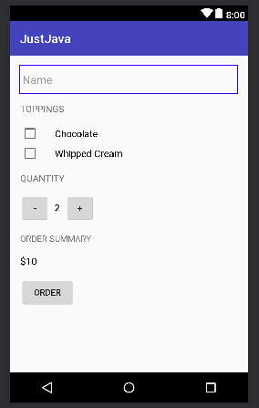

Just Java Android App
=======================

Description
-----------------------

A project completed with the Udacity's Android Basics courses. 

This app takes in a users name, what toppings they want, and how much cups of coffees they want.
On clicking the ORDER button, they will be displayed a summary of their order with price calculated
on the app and will be given the choice to send the summary order to their email.

This app is for a fictional coffee shop.

This project had given me the chance to improve and learn Java and object oriented programming. It,
also, opened me up to working on mobile devices. It was incredibly fun getting to know how to properly
layout an app and hook all the buttons up with each other with Java. It is, also, neat seeing
something I've coded be displayed on a smartphone. Hoping to make more apps in the future.

A few roadblocks was learning XML from scratch but that was pretty easy to handle. Some smaller roadblocks
include getting the layout to display exactly how I want it to and making my app translatable to spanish.
Another roadblock was working with Android Studio, which was incredibly daunting since there were so many
folders and buttons and other unfamilliar interfaces that it was overwhelming. But, pushing through with 
the courses, they are no longer scary.

In the future, I'd love to invest in a cheap android smartphone so I could better troubleshoot my projects.
I used an emulator for this app which had served its purpose but in order to use Intents and get a better
feel for how the app is going on an actual device, I would need a physical android smartphone. I would, also,
love to add support for other latino languages, French, and Russian and more languages.
 

